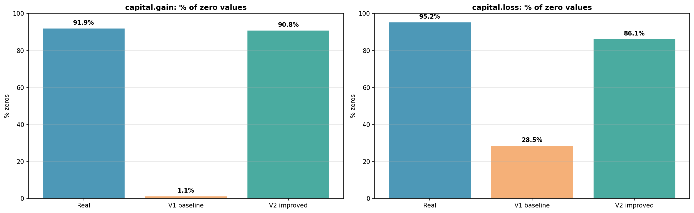
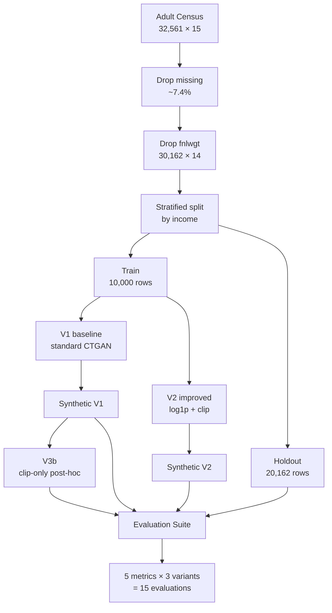
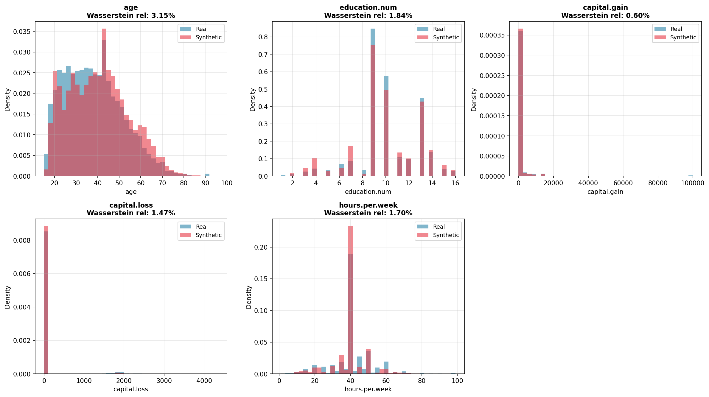
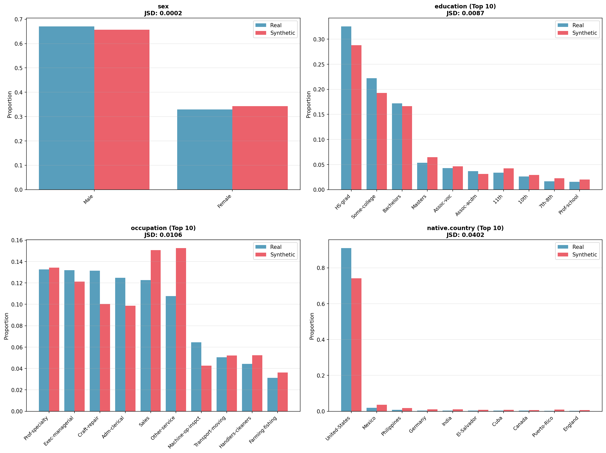
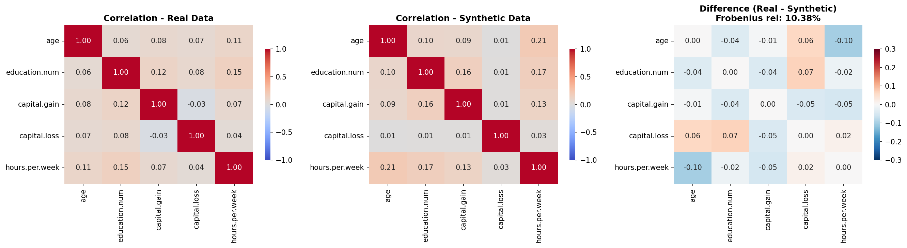
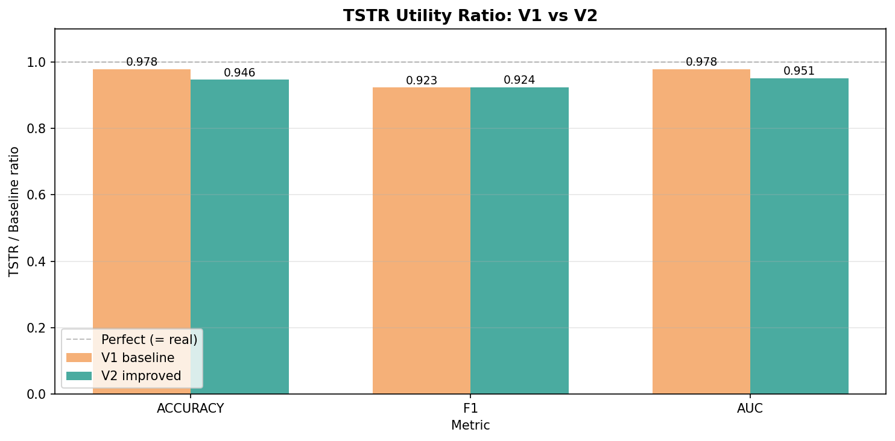
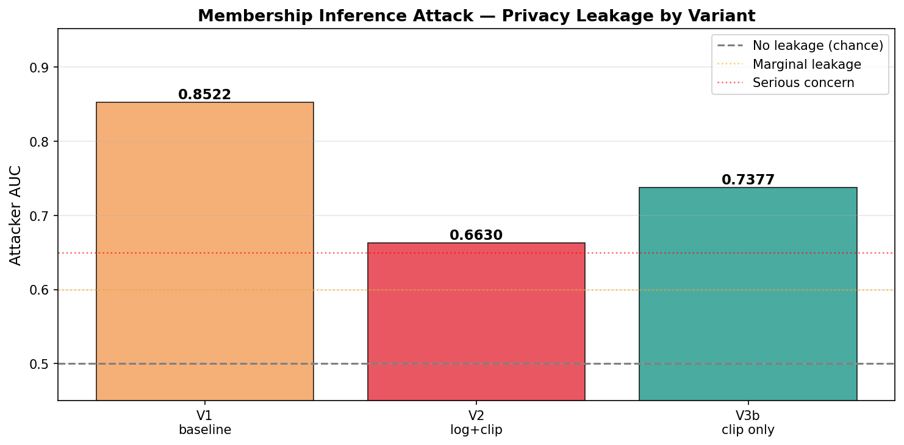

# CTGAN Critical Evaluation on Adult Census Income

A rigorous, multi-dimensional evaluation of CTGAN for tabular synthetic data generation, revealing that **logical validity, predictive utility, and privacy are in tension** — and that the simpler intervention often wins.

[](https://www.python.org/)
[](https://github.com/sdv-dev/CTGAN)
[](https://pytorch.org/)
[](LICENSE)
[]()

---

## Table of Contents

- [TL;DR](#tldr)
- [The Hero Finding](#the-hero-finding)
- [Findings at a Glance](#findings-at-a-glance)
- [Motivation](#motivation)
- [Methodology](#methodology)
- [Five Key Findings](#five-key-findings)
- [Detailed Results](#detailed-results)
- [What This Project Demonstrates](#what-this-project-demonstrates)
- [Limitations & Future Work](#limitations--future-work)
- [Reproducibility](#reproducibility)
- [Tech Stack](#tech-stack)
- [Repository Structure](#repository-structure)
- [References](#references)

---

## TL;DR

This project evaluates three variants of CTGAN on the UCI Adult Census Income dataset, applying five complementary metrics across four evaluation dimensions: **fidelity** (Wasserstein, JSD, Frobenius), **utility** (TSTR), **memorization** (DCR), and **privacy** (MIA).

**Key result**: the standard CTGAN baseline (V1) generates **62% logically invalid values** (negative capital gains) despite achieving favorable distributional metrics. Two interventions were tested:

- **V2** (log-transform + clip): fixed validity at the cost of predictive utility and induced partial mode collapse.
- **V3b** (clip-only post-processing): achieved validity AND preserved utility, with a single line of code.

There is no universally best variant. The optimal choice depends on the application's priority: predictive accuracy, anonymization, or regulatory compliance.

---

## The Hero Finding



The V1 baseline distributes synthetic mass symmetrically around zero, generating thousands of impossible negative capital values. Standard distributional metrics (Wasserstein, JSD) failed to detect this because they are **invariant to logical validity** — they measure how much "transport cost" is needed between distributions, not whether the destination values are semantically valid.

This single finding motivated the entire diagnostic effort that followed.

---

## Findings at a Glance

| Dimension                | V1 baseline      | V2 (log + clip)    | V3b (clip only)   |
|--------------------------|------------------|--------------------|-------------------|
| Negative values          | ✗ 62% invalid   | ✓ 0% invalid       | ✓ 0% invalid      |
| Mass at zero (gain)      | 1.15%            | 90.85%             | 63.10%            |
| Wasserstein (avg %)      | 1.75%            | 1.98%              | 1.75%             |
| JSD (max categorical)    | 0.0402           | 0.0269             | 0.0402            |
| Frobenius relative       | 10.38%           | **9.04%**          | 10.38%            |
| TSTR Accuracy ratio      | **0.978**        | 0.946              | 0.973             |
| TSTR AUC ratio           | **0.978**        | 0.951              | 0.969             |
| TSTR F1 ratio            | 0.923            | **0.924**          | 0.901             |
| Continuous diversity     | ✓ 0.2% matches  | ✗ 47% mode collapse | ✓ 28% matches    |
| MIA Attack AUC (privacy) | ✗ 0.852          | ✓ 0.663            | 0.738             |

Bold = best in row. Each variant wins on at least one dimension. **No single variant dominates the others.**

---

## Motivation

CTGAN (Xu et al., 2019) is a popular generative model for tabular synthetic data, with documented applications in financial anonymization, clinical research, and class imbalance correction. Most evaluation pipelines in the literature and on GitHub report:

- A few distributional distances (Wasserstein, JSD)
- TSTR (Train on Synthetic, Test on Real) for utility
- Sometimes a coarse memorization check

This project asks: **what does a rigorous evaluation reveal that standard pipelines miss?** Specifically:

1. Do CTGAN's synthetic values respect the logical bounds of the variables they model?
2. Do common preprocessing "improvements" actually improve all evaluation dimensions, or do they introduce hidden trade-offs?
3. Is privacy adequately captured by geometric memorization checks (DCR), or does it require adversarial testing (MIA)?

The answers to these questions, derived from controlled experiments on Adult Census, are the core contribution of this repository.

---

## Methodology

### Pipeline overview



### Three variants compared

| Variant | Log-transform on capital.* | Clip negatives | Description                      |
|---------|---------------------------|----------------|----------------------------------|
| V1      | No                        | No             | Standard CTGAN baseline          |
| V2      | Yes (log1p)               | Yes            | Both interventions combined      |
| V3b     | No                        | Yes (post-hoc) | Diagnostic isolating clip's effect |

V3a (V2 without rounding), V3c (log without clip), and V3d (V2 with 500 epochs) are documented as future work — see [Limitations](#limitations--future-work).

### Five evaluation metrics

| Metric                      | Dimension              | What it measures                             |
|-----------------------------|------------------------|----------------------------------------------|
| Wasserstein distance        | Fidelity (continuous)  | Distributional distance variable-by-variable |
| Jensen-Shannon Divergence   | Fidelity (categorical) | Categorical distribution alignment           |
| Frobenius norm              | Multivariate structure | Correlation matrix preservation              |
| TSTR (Random Forest)        | Utility                | Predictive performance on real holdout       |
| DCR + MIA                   | Memorization & Privacy | Geometric and adversarial leakage            |

Plus a domain-specific **logical validity check** (negative-value audit) added during the analysis after detecting the V1 failure.

---

## Five Key Findings

### Finding 1 — Distributional metrics hide structural failures

The V1 baseline scored excellently on Wasserstein for the zero-inflated capital variables (relative distances of 0.60% and 1.47%), passing standard fidelity checks. A direct audit revealed:

- **6,195 of 10,000** synthetic `capital.gain` values were negative (**61.95%**)
- **3,570 of 10,000** synthetic `capital.loss` values were negative (**35.70%**)

Both quantities are impossible by definition (capital gains and losses cannot be negative), yet Wasserstein gave them favorable scores because the metric is invariant to value validity.

> **Lesson**: distributional fidelity ≠ semantic validity. Domain validation must complement statistical metrics.

### Finding 2 — V2 fixed validity but introduced new failures

The log1p + clip pipeline (V2) eliminated 100% of negative values and recovered the mass at zero (**90.85% in V2 vs 91.92% real** for capital.gain). However:

- TSTR Accuracy dropped from **0.978 (V1)** to **0.946 (V2)**
- TSTR AUC dropped from **0.978** to **0.951**
- **47% of V2's synthetic samples** were exact-match combinations of real records on the 5 continuous variables — a manifestation of **partial mode collapse**

The same combination `(age=28, education=9, capital.gain=0, capital.loss=0, hours.per.week=40)` appeared **79 times in 10,000 samples**. The log-transform compressed the continuous space too aggressively, causing the model to converge to population-typical profiles.

### Finding 3 — V3b: the simpler solution wins on utility

A diagnostic variant — V1's synthetic data with only the clip operation applied post-hoc — preserved V1's predictive performance (Accuracy 0.973, AUC 0.969) while eliminating all invalid values. This isolated the conclusion that:

- **Clipping alone is benign** for downstream prediction
- **The log-transform was the cause of V2's TSTR degradation**

V3b achieves the validity goal of V2 with the utility of V1, at zero additional computational cost. A single line of post-processing:

```python
synthetic[col] = synthetic[col].clip(lower=0)
```

### Finding 4 — Privacy paradox

A Membership Inference Attack revealed that the variants' privacy profiles **inverted** their utility profiles:

| Variant | TSTR AUC (utility) | MIA AUC (lower = more private)        |
|---------|--------------------|---------------------------------------|
| V1      | **0.978** best     | **0.852** worst leakage               |
| V2      | 0.951 worst        | **0.663** best privacy                |
| V3b     | 0.969 second       | 0.738 intermediate                    |

V2's mode collapse, which hurt utility, **paradoxically protected privacy**: when the model converges to population-typical profiles, both members and non-members have similar distances to the synthetic samples, denying the attacker its discriminative signal.

### Finding 5 — DCR is insufficient for detecting modal degeneracy

The standard DCR metric reported V2 with `dcr_to_holdout = 0.0000`, which the heuristic interpretation classified as "perfect generalization". In reality, this was caused by 52% exact-match rates between V2's synthetic samples and the holdout — modal degeneracy, not memorization.

> **Lesson**: privacy and diversity require multiple complementary metrics. Geometric memorization checks (DCR) and adversarial attacks (MIA) capture different failure modes.

---

## Detailed Results

### Distributional fidelity



*Real vs. V1 synthetic — continuous variables. The apparent overlap on capital.gain hides the 62% of negative values audited separately.*



*Real vs. V1 synthetic — selected categorical variables. JSD scores all under 0.05 confirm that CTGAN's Conditional Sampling successfully prevented mode collapse on native.country (40 categories with extreme imbalance).*

### Correlation preservation



*V1 correlation analysis — Frobenius relative norm 10.38%. The age × hours.per.week correlation was inflated from 0.11 (real) to 0.21 (synthetic), an example of spurious dependency amplification.*

V2 reduced this distortion to 9.04% Frobenius relative norm and lowered the age × hours.per.week deviation by 38%.

### TSTR utility comparison



*V1 vs V2 utility ratios (TSTR / real-train baseline). V1 wins on accuracy and AUC; V2 marginally wins on F1.*

### Privacy via MIA



*Attacker AUC across the three variants. V1's AUC of 0.852 means a privacy adversary can correctly identify training-set members from non-members with 75% accuracy using only the synthetic data — a serious vulnerability for any anonymization use case.*

---

## What This Project Demonstrates

This repository is intended as a portfolio piece. For reviewers evaluating technical depth, the project showcases:

**Engineering practices**
- Modular Python architecture (`src/` separated from `notebooks/`)
- Centralized configuration (`src/config.py`) — no magic numbers in production code
- Type hints and NumPy-style docstrings throughout
- Pure functions with single-responsibility design (Single Responsibility Principle)
- Pinned dependencies in `requirements.txt` for exact reproducibility
- Conventional Commits semantic history (`feat:`, `chore:`, `docs:`, `refactor:`)

**Statistical and ML rigor**
- Stratified train/holdout split with a hard separation for unbiased TSTR
- Five complementary evaluation metrics covering four orthogonal dimensions
- Implementation of Membership Inference Attack from scratch (not just imported)
- Critical analysis that detected and diagnosed three subtle failure modes (logical invalidity, mode collapse, privacy leakage paradox)

**Methodological honesty**
- Documented results that contradict initial hypotheses (V2's TSTR loss)
- Explicit trade-off framing rather than "everything improved"
- Future work clearly enumerated with concrete experimental designs (V3a, V3c, V3d)
- Limitations of standard metrics discussed, not hidden

**Domain awareness**
- Identified zero-inflated variables as a class of cases where CTGAN's Mode-Specific Normalization fails
- Connected the failure mode to real-world domains (healthcare LOS, e-commerce refunds, insurance claims)
- Used Adult Census, the standard CTGAN benchmark from the original paper

---

## Limitations & Future Work

This evaluation is constrained by scope and computational budget. Identified directions for further investigation:

**V3a — V2 without integer rounding.** Test whether the rounding step in V2's pipeline contributes to TSTR loss. Requires regenerating V2 synthetic data with floats preserved.

**V3c — Log-transform without clipping.** Isolate the log-transform's effect from clipping by training a model with log-transform but no post-hoc clip. Cannot be reconstructed from existing data because clipping is mathematically irreversible.

**V3d — V2 with extended training (500+ epochs).** Test whether longer training compensates for the information loss in V2's log-transformed scale. Risk: overfitting that the current 300-epoch budget mitigates.

**Two-step modeling.** Replace the log-transform approach with a Bernoulli model for `P(x = 0)` plus a conditional distribution for `P(x | x > 0)`, analogous to the structure used in the GAIN imputation paper (Yoon et al., 2018). This is the principled solution from the literature for zero-inflated variables.

**Differential privacy guarantees.** This project measured privacy empirically via MIA but did not provide formal guarantees. CTGAN with differentially private SGD (DP-SGD) would offer provable bounds at the cost of utility.

**Larger dataset and TVAE comparison.** The 10,000-sample subset enabled tractable iteration; full Adult (~30,000 cleaned rows) and a head-to-head comparison against TVAE would strengthen external validity.

**Asymmetric holdout DCR.** The current DCR implementation does not normalize for the size difference between train (10K) and holdout (20K). A future iteration should subsample the holdout to match train size before computing nearest-neighbor distances.

---

## Reproducibility

### Setup

```bash
# Clone the repo
git clone https://github.com/pabdus/ctgan-adult-critical-evaluation.git
cd ctgan-adult-critical-evaluation

# Create a virtual environment (recommended)
python -m venv venv
source venv/bin/activate   # Linux/Mac
# venv\Scripts\activate    # Windows

# Install pinned dependencies
pip install -r requirements.txt
```

### Get the data

The Adult Census dataset is not included in the repo. See [`data/README.md`](data/README.md) for download instructions. Place `adult.csv` in `data/raw/`.

### Run the full pipeline

```bash
# End-to-end: preprocess + train V1 + train V2 + persist results
python run_training.py
```

Estimated runtime: ~60 minutes on CPU (30 min per CTGAN training). The script persists synthetic datasets to `results/v1_baseline/` and `results/v2_improved/`.

### Explore the analysis

```bash
jupyter notebook notebooks/
```

Open the notebooks in order:

1. **`01_exploration_preprocessing.ipynb`** — dataset exploration, missing-value diagnostics, zero-inflated variable analysis, preprocessing pipeline.
2. **`02_baseline_v1.ipynb`** — V1 baseline evaluation with five metrics and the critical finding on logical validity.
3. **`03_improved_v2.ipynb`** — V2 evaluation, V3b diagnostic, mode-collapse investigation, MIA privacy analysis, and the final synthesis.

---

## Tech Stack

- **Python 3.14**
- **CTGAN 0.10** (SDV ecosystem) — generative model
- **PyTorch 2.4** — deep learning backend
- **pandas, NumPy, SciPy** — data processing and statistics
- **scikit-learn** — Random Forest classifier (TSTR), Nearest Neighbors (DCR, MIA), preprocessing pipelines
- **matplotlib, seaborn** — visualization

All dependencies pinned in `requirements.txt` for exact reproducibility.

---

## Repository Structure

```
ctgan-adult-critical-evaluation/
├── README.md                    # This document
├── LICENSE                      # MIT
├── requirements.txt             # Pinned dependencies
├── run_training.py              # End-to-end training script
│
├── src/                         # Reusable modules
│   ├── config.py                # Constants, paths, hyperparameters
│   ├── preprocessing.py         # Adult Census loading and cleaning
│   ├── training.py              # V1 and V2 CTGAN pipelines
│   ├── evaluation.py            # 5 metrics + MIA implementation
│   └── visualization.py         # Reusable plot functions
│
├── notebooks/                   # Analytical narratives
│   ├── 01_exploration_preprocessing.ipynb
│   ├── 02_baseline_v1.ipynb
│   └── 03_improved_v2.ipynb
│
├── data/
│   ├── README.md                # How to obtain Adult Census
│   └── raw/                     # adult.csv (not committed)
│
└── results/
    ├── v1_baseline/
    │   ├── real_train.csv       # 10K stratified training sample
    │   ├── real_holdout.csv     # 20K holdout for TSTR
    │   ├── synthetic.csv        # V1 synthetic data
    │   └── plots/               # V1 evaluation visualizations
    └── v2_improved/
        ├── synthetic.csv        # V2 synthetic data
        └── plots/               # V2 + V3b + comparison visualizations
```

---

## References

Becker, B., & Kohavi, R. (1996). Adult [Dataset]. UCI Machine Learning Repository. https://doi.org/10.24432/C5XW20

Goodfellow, I., Pouget-Abadie, J., Mirza, M., et al. (2014). Generative Adversarial Nets. *Advances in Neural Information Processing Systems, 27*, 2672–2680.

Kingma, D. P., & Welling, M. (2014). Auto-encoding variational Bayes. *International Conference on Learning Representations*. https://arxiv.org/abs/1312.6114

Shokri, R., Stronati, M., Song, C., & Shmatikov, V. (2017). Membership Inference Attacks Against Machine Learning Models. *2017 IEEE Symposium on Security and Privacy*, 3–18. https://doi.org/10.1109/SP.2017.41

Vaswani, A., Shazeer, N., Parmar, N., et al. (2017). Attention Is All You Need. *Advances in Neural Information Processing Systems, 30*, 5998–6008.

Xu, L., Skoularidou, M., Cuesta-Infante, A., & Veeramachaneni, K. (2019). Modeling Tabular Data using Conditional GAN. *Advances in Neural Information Processing Systems, 32*, 7335–7345.

Yoon, J., Jordon, J., & van der Schaar, M. (2018). GAIN: Missing Data Imputation using Generative Adversarial Nets. *Proceedings of the 35th International Conference on Machine Learning (ICML)*, 5689–5698.

Zhao, Z., Kunar, A., Birke, R., & Chen, L. Y. (2022). CTAB-GAN+: Enhancing Tabular Data Synthesis. *Frontiers in Big Data, 6*, 1296508. https://doi.org/10.3389/fdata.2023.1296508

---

## Author

**Pablo Alberto Duque Marín**
Master in Artificial Intelligence — Universidad Internacional de La Rioja (UNIR)
Manizales, Caldas, Colombia

[GitHub](https://github.com/pabdus)

---

*This project was developed as part of the postgraduate specialization in Generative AI Applied to Data Analysis at UNIR. The critical analysis methodology evolved through iterative dialogue and empirical experimentation.*
